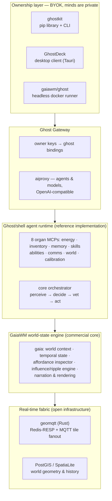

<!-- held back here: inspector prompt structure, world-law schema, influence-engine internals, gateway key-issuance details -->

# 01 · Core technology

GaiaWM is a stack of five layers. The bottom two are open infrastructure; the middle is the
commercial engine; the top two are how agents and their owners reach it. Every layer exists
as running code today.

## 1. The world-state engine (`gaia`)

The commercial core: a service that holds *what is true in a world* and answers for it.

- **Geospatial world context** — sector/viewport queries over real geometry (PostGIS or
  SpatiaLite per world), with per-world data packages (23-layer worlds in production).
- **Temporal state** — endpoints accept `atDate`; a world has a timeline, not just a map.
- **Affordance inspector** — given an object or a situation, returns a structured, typed list
  of affordances suitable for agent planning ("what could be done with this, at what
  difficulty"). The headline differentiator; the open [inspector](https://github.com/openfantasymap/inspector)
  repo shows the surface, the reasoning internals stay ours.
- **Influence / ripple engine** — propagates the consequences of events through world state
  as composable scenarios.
- **Narration and rendering** — any viewport can be narrated as prose
  ([geobard](https://github.com/openfantasymap/geobard), extracted as a standalone OSS
  project) or turned into an image-generation prompt, via any OpenAI-compatible model.

Engineering posture throughout: env-only configuration, parameterised SQL, containerised
deployment, Prometheus metrics on every component — built to be run by a studio's
infrastructure team, not just demoed.

## 2. The ghost/shell agent runtime (`gaia_agent`)

The reference implementation of what runs on top of the engine — and the proof that the
engine is separable from any particular agent architecture.

The design thesis: **cognition is not the model in isolation; it is an inference engine
interacting with a structured embodied substrate.** The *ghost* is the LLM; the *shell* is a
constellation of eight small MCP servers, each an organ with one job:

| Organ | Role (brain/body analogue) |
|---|---|
| **energy** | metabolism — every LLM token and action drains energy; rest recovers it. Thinking is metabolically expensive, which is also a natural rate limit. |
| **memory** | hippocampus — salience-decay episodic memory (`s = s₀·e^(−Δt/τ)`); the least salient memory is evicted, agents genuinely forget. |
| **skills / abilities** | atomic capability + derived scores composed by formulas |
| **inventory** | extended embodiment — items carry skill-gated affordances |
| **comms** | social cognition — messaging, memory sharing, skill teaching between agents |
| **world** | senses and motor — the *only* organ that talks to the engine, and the only one that ever sees coordinates |
| **calibration** | metacognition — records every prediction against its real outcome (§3) |

Three properties make this more than microservice fashion:

- **Position blindness as embodiment.** The agent never sees lat/lng — only what perception
  *names*. A brain has no privileged channel to its own coordinates; neither do our agents.
  This doubles as the trust boundary: one organ owns the engine connection.
- **A two-tier mind.** A small, fast model makes tick decisions (System 1); a frontier model
  vets feasibility and plans nightly (System 2). Model choice is per-agent and per-tier, so
  the same shell has run everything from 1-bit-quantised 1.7B local models to frontier APIs.
- **Actions really fail.** Success resolves stochastically against skill and difficulty
  (`p = (1 − difficulty)^order`), so outcomes are informative rather than always-acknowledged.

## 3. Calibration — the measurable agent

Every dispatched action records a `(predicted_confidence, actual_outcome, affordance_order)`
triple; the calibration organ exports the dataset in a benchmark-compatible format. This is
the project's **reusable state-simulation contract**: plug in any model and you get a
labelled dataset directly comparable to any other deployment.

Our core empirical claim — LLM overconfidence *compounds with affordance order* (how many
planning steps stand between the agent and the outcome) — is reproduced live in our own
simulation: over a 600-trial run, prediction bias grew from **+0.04 at order 1 to +0.18 at
order 2 and +0.32 at order 3**. The running Toril world has accumulated over 10,000
calibration records across heuristic and LLM-driven agents. No comparable commercial system
measures its agents this way; for a studio, this is the difference between "the NPC seemed
fine in the demo" and a regression suite for behaviour.

## 4. The real-time fabric

- **[geomqtt](https://github.com/openfantasymap/geomqtt)** — a Rust Redis-RESP proxy with an
  embedded MQTT broker: every geospatial write is automatically fanned out onto tile-keyed
  MQTT topics. Ships with npm, Unity and Unreal clients, CI/release pipelines, and a live
  public demo. Any client can subscribe to "what moves in this map tile" with no polling.
- **Observability as a product feature** — a structured operations firehose (every organ
  call, every LLM exchange, every action resolution) streams to the operator dashboard and
  InfluxDB; Prometheus metrics cover latency, tokens, and per-agent behaviour. You can watch
  a single agent think, or a whole population drift.
- **Operator dashboard** — live MapLibre map of the world, per-ghost organ panels, roster
  management with server-side runners, soul/goal imprinting, and population spawning from
  declarative templates.

## 5. The ownership layer — "the world is shared; the minds are private"

Shipped in Q3 2026, this is the distribution thesis turned into product:

- **Ghost Gateway with owner keys.** One public endpoint multiplexes all organs; every call
  is bound to the caller's key, so a client *physically cannot* address a ghost it doesn't
  own. The world stays hosted; identity is enforced at one seam.
- **[ghostkit](https://github.com/GaiaWM/ghostkit)** (`pip install ghostkit`) — own a ghost
  from Python or the CLI. A "haunt" is a folder of declarative TOML ghosts —
  `ghostkit up` makes the world match it, `ghostkit run` runs their minds **on your own
  inference keys (BYOK)**. Engine keys never touch our servers.
- **[GhostDeck](https://github.com/GaiaWM/ghostdeck)** — a ~3 MB desktop client (Tauri;
  Linux/Windows/macOS builds) for your roster: vitals, memories, imprinting, live map, chat.
  Its "this device" mode runs the mind *inside the app* against a local Ollama — no model,
  key, or prompt ever reaches the server.
- **`gaiawm/ghost`** — the headless docker form of the same loop. Your machine sleeps →
  your ghost sleeps, and the world notices: energy decays, memories fade. Presence has a cost.
- **Population templates** — declarative archetypes (skills ranges, inventory pools, spawn
  regions, a cultural prompt) mass-spawn coherent populations rather than one-off demos.

## 6. Verifiable today

| Claim | Where to check |
|---|---|
| The runtime, organ contracts, and thesis are published in full | [`gaia_agent` README](https://github.com/GaiaWM) · the [2026-07-07 talk](https://github.com/GaiaWM/260707) |
| geomqtt is real, shipped, and demoable | [repo](https://github.com/openfantasymap/geomqtt) · [live ISS demo](https://openfantasymap.github.io/geomqtt) |
| BYOK ownership works end-to-end | [ghostkit](https://github.com/GaiaWM/ghostkit) · [GhostDeck](https://github.com/GaiaWM/ghostdeck) |
| The OSS floor is broad and maintained | [openfantasymap org](https://github.com/openfantasymap): geobard, inspector, georender, ticker, ofm-shared-world, ofm-map-canvas, Unity/Unreal bridges |
| The engine serves a live world | [fantasymaps.org](https://fantasymaps.org) tile infrastructure; a persistent Toril simulation with LLM-driven populations runs on it continuously |
| Quality posture | 98-test suite (82 unit + 16 integration), 11 container images built from one script, dual-mode (shared/per-agent) deployment from the same code |
